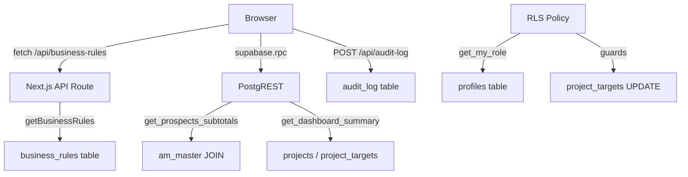

# Design Document: PMO App Improvements

## Overview

This document describes the technical design for nine targeted improvements to the PMO Application. The improvements close known gaps identified in `project_analysis.md` Section 10 and are grouped into five categories:

| Category | Items | Description |
|---|---|---|
| A: Security Hardening | #1, #2 | Remove client-controlled AM scope from RPC; restrict financial column writes |
| B: Type Safety | #3 | Regenerate stale `database.types.ts` and remove `as any` casts |
| C: Observability | #4 | Add latency logging to Dashboard Summary RPC calls |
| D: Code Cleanup | #5, #6, #7 | Remove dead files; fix business rules defaults; archive loose SQL |
| E: UX Fixes | #8, #9 | Wire "Forgot?" button; surface audit log failures |

None of these changes introduce new product features. Each closes a specific gap without altering user-facing behavior beyond what is explicitly required (the "Forgot?" button and the "not configured" banner).

---

## Architecture

The application follows a layered architecture:

```
Browser (Next.js Client Components)
        │
        ▼
Next.js App Router (Server Components / API Routes)
        │
        ▼
Supabase PostgREST / Auth
        │
        ▼
PostgreSQL (RLS policies, RPCs, triggers)
```

The improvements touch all three layers:

- **Database layer**: Improvements #1 and #2 (new migration files)
- **Type layer**: Improvement #3 (regenerated `database.types.ts`)
- **Frontend layer**: Improvements #4, #6, #8, #9 (TypeScript/React changes)
- **Repository hygiene**: Improvements #5 and #7 (file deletions)



---

## Components and Interfaces

### Improvement #1 — Prospects Subtotals RPC

**Current interface:**
```sql
get_prospects_subtotals(
  p_batch_number integer,
  p_allowed_ams  text[],        -- ← client-controlled, to be removed
  p_search_query text DEFAULT '',
  p_start_date   text DEFAULT NULL,
  p_end_date     text DEFAULT NULL,
  p_category_filter text DEFAULT 'all'
)
```

**New interface:**
```sql
get_prospects_subtotals(
  p_batch_number    integer,
  -- p_allowed_ams removed
  p_search_query    text DEFAULT '',
  p_start_date      text DEFAULT NULL,
  p_end_date        text DEFAULT NULL,
  p_category_filter text DEFAULT 'all'
)
```

The caller in `frontend/app/dashboard/prospects/page.tsx` must drop the `p_allowed_ams` argument:
```ts
// Before
await supabase.rpc("get_prospects_subtotals", {
  p_batch_number: maxBatch,
  p_allowed_ams: allowedAMs,   // ← remove this line
  p_search_query: ...,
  ...
});

// After
await supabase.rpc("get_prospects_subtotals", {
  p_batch_number: maxBatch,
  p_search_query: ...,
  ...
});
```

### Improvement #2 — Project Targets Column-Scoped UPDATE Policy

**Current policy (from migration 005):**
```sql
CREATE POLICY "project_targets_update"
  ON public.project_targets FOR UPDATE TO authenticated
  USING (true)
  WITH CHECK (true);   -- ← any column, any user
```

**New approach — BEFORE UPDATE trigger:**

PostgreSQL RLS does not natively support column-level restrictions in UPDATE policies. The recommended approach is a `BEFORE UPDATE` trigger that raises an exception when a non-admin role attempts to modify any column other than `status`.

```sql
-- New trigger function
CREATE OR REPLACE FUNCTION public.enforce_project_targets_column_scope()
RETURNS TRIGGER LANGUAGE plpgsql SECURITY DEFINER
SET search_path = public AS $$
BEGIN
  IF public.get_my_role() NOT IN ('Superadmin', 'Project Administrator') THEN
    -- Allow only status changes
    IF (NEW.* IS DISTINCT FROM OLD.*) AND (
      NEW.project_id        IS DISTINCT FROM OLD.project_id OR
      NEW.total             IS DISTINCT FROM OLD.total OR
      NEW.gp_acc            IS DISTINCT FROM OLD.gp_acc OR
      -- ... all non-status columns
      NEW.batch_number      IS DISTINCT FROM OLD.batch_number
    ) THEN
      RAISE EXCEPTION 'Non-admin roles may only update the status column';
    END IF;
  END IF;
  RETURN NEW;
END;
$$;
```

The existing `project_targets_update` policy remains `USING (true) WITH CHECK (true)` so that non-admin users can still reach the trigger. The trigger then enforces the column restriction.

### Improvement #3 — Database Types Regeneration

**Files affected:**
- `frontend/lib/database.types.ts` — regenerated output
- `frontend/lib/database.types.ts.tmp` — deleted
- `frontend/lib/business-rules.server.ts` — remove `as any` cast
- Any other server file casting the admin client to `any`

**Pattern to replace:**
```ts
// Before
const db = () => getSupabaseAdmin() as any;

// After — once types include business_rules and audit_log
const db = () => getSupabaseAdmin();
// Use typed .from("business_rules") directly
```

### Improvement #4 — Dashboard Latency Logging

**Current `fetchDashboardSummary` (simplified):**
```ts
async function fetchDashboardSummary() {
  const { data, error } = await supabase.rpc("get_dashboard_summary");
  // no latency logging
}
```

**After:**
```ts
async function fetchDashboardSummary() {
  const startTime = performance.now();
  const { data, error } = await supabase.rpc("get_dashboard_summary");
  const endTime = performance.now();
  console.log(`[Dashboard] Query latency: ${(endTime - startTime).toFixed(2)}ms`);
  // existing logic unchanged
}
```

This matches the pattern used in Projects, Prospects, Backlog, and Sales Performance pages exactly.

### Improvement #5 — Dead Code Removal

Files to delete:
- `frontend/lib/local-json-store.server.ts`
- `frontend/data/audit-log.json`
- `frontend/data/business-rules.json`
- `frontend/lib/database.types.ts.tmp`

No import updates are needed — these files are already unused.

### Improvement #6 — Business Rules Defaults and "Not Configured" Banner

**`frontend/lib/business-rules.shared.ts` changes:**

```ts
// Before
export const defaultBusinessRules: BusinessRules = {
  targetGrossProfit: 36_000_000_000,
  allowedAccountManagers: ["Andrew Daniel Gunalan", ...],  // 7 hardcoded names
  kpiProjectManagers: ["yohanes ivan enda", ...],          // 4 hardcoded names
  keywordRules: {
    strictFccKeywords: [...],   // ~10 entries
    strictCssKeywords: [...],   // ~11 entries
    fccKeywords: [...],         // ~100+ entries
    cssKeywords: [...],         // ~100+ entries
  },
};

// After
export const defaultBusinessRules: BusinessRules = {
  targetGrossProfit: 36_000_000_000,  // preserved
  allowedAccountManagers: [],
  kpiProjectManagers: [],
  keywordRules: {
    strictFccKeywords: [],
    strictCssKeywords: [],
    fccKeywords: [],
    cssKeywords: [],
  },
};
```

**`normalizeBusinessRules` changes:**

Remove all fallback-to-defaults for array fields:
```ts
// Before
allowedAccountManagers:
  allowedAccountManagers.length > 0
    ? allowedAccountManagers
    : defaultBusinessRules.allowedAccountManagers,  // ← remove fallback

// After
allowedAccountManagers: allowedAccountManagers,  // empty if DB is empty
```

**New `BusinessRulesNotConfigured` component:**

```tsx
// frontend/components/business-rules-not-configured.tsx
interface Props {
  isSuperadmin: boolean;
  missingFields: string[];
}

export function BusinessRulesNotConfigured({ isSuperadmin, missingFields }: Props) {
  if (missingFields.length === 0) return null;
  return (
    <div className="rounded-xl border border-amber-300 bg-amber-50 dark:bg-amber-950/20 px-4 py-3 text-sm text-amber-800 dark:text-amber-300 flex items-center gap-3">
      <AlertTriangle className="h-4 w-4 shrink-0" />
      <span>
        Business rules not configured ({missingFields.join(", ")} empty).
        {isSuperadmin && (
          <> <Link href="/dashboard/business-rules" className="underline font-medium">Configure now →</Link></>
        )}
      </span>
    </div>
  );
}
```

Pages that consume `allowedAccountManagers`, `kpiProjectManagers`, or keyword arrays render this banner when the relevant field is empty.

### Improvement #7 — Archive Loose SQL Files

**Audit process before deletion:**

Each loose SQL file must be checked against migrations 000–008 to confirm its DDL/DML is already covered. Based on the codebase analysis:

| Loose File | Status |
|---|---|
| `add_batch_columns.sql` | Covered by 001 |
| `add_category_columns.sql` | Covered by 001 |
| `add_classification_columns.sql` | Covered by 001 |
| `backlog_subtotals_rpc.sql` | Covered by 007 |
| `batch_metadata.sql` | Covered by 003 |
| `dashboard_summary.sql` | Covered by 007 |
| `fix_backlog_status.sql` | Covered by 001 (status column exists) |
| `project_targets_schema.sql` | Covered by 001 |
| `projects_schema.sql` | Covered by 001 |
| `prospects_performance_indices.sql` | Covered by 004 |
| `prospects_schema.sql` | Covered by 001 |
| `prospects_subtotals_rpc.sql` | Covered by 007; superseded by improvement #1 |
| `resync_metadata.sql` | Covered by 003 |
| `sales_performance_rpc.sql` | Covered by 008 |
| `truncate_all_data.sql` | Utility script — no DDL, safe to remove |

If the audit reveals any uncovered DDL, a new migration `backend/migrations/011_*.sql` must be created before deletion.

### Improvement #8 — "Forgot?" Button

**State additions to `frontend/app/page.tsx`:**
```ts
const [forgotLoading, setForgotLoading] = useState(false);
const [forgotMessage, setForgotMessage] = useState("");
const [forgotError, setForgotError] = useState("");
```

**Handler:**
```ts
const handleForgotPassword = async () => {
  const cleanEmail = email.trim().toLowerCase();
  const emailRegex = /^[^\s@]+@[^\s@]+\.[^\s@]+$/;

  if (!cleanEmail || !emailRegex.test(cleanEmail)) {
    setForgotError("Please enter a valid email address first.");
    return;
  }

  setForgotLoading(true);
  setForgotError("");
  setForgotMessage("");

  try {
    const { error } = await supabase.auth.resetPasswordForEmail(cleanEmail, {
      redirectTo: `${window.location.origin}/dashboard`,
    });
    if (error) throw error;
    setForgotMessage("If this email is registered, a reset link has been sent.");
  } catch {
    setForgotMessage("If this email is registered, a reset link has been sent.");
    // Intentionally same message — do not leak whether email exists
  } finally {
    setForgotLoading(false);
  }
};
```

**Button update:**
```tsx
<button
  type="button"
  onClick={handleForgotPassword}
  disabled={forgotLoading || loading}
  className="text-[10px] font-bold uppercase tracking-tighter text-primary transition-colors hover:opacity-80 disabled:opacity-50"
>
  {forgotLoading ? "Sending..." : "Forgot?"}
</button>
```

Inline validation error and success message are rendered below the password field or in the existing error/success alert slots.

### Improvement #9 — Audit Log Error Surfacing

**Current pattern (all three upload handlers):**
```ts
void authenticatedFetch("/api/audit-log", { method: "POST", body: ... });
// fire-and-forget — failures are silently swallowed
```

**New pattern:**
```ts
authenticatedFetch("/api/audit-log", {
  method: "POST",
  body: JSON.stringify({ type: "upload", action: "created", ... }),
})
  .then(async (res) => {
    if (!res.ok) {
      console.error(
        `[Audit] Failed to log ${eventType}: HTTP ${res.status}`
      );
    }
  })
  .catch((err) => {
    console.error(`[Audit] Failed to log ${eventType}:`, err);
  });
```

The `eventType` variable is the `targetType` string already present in each handler (`"projects_batch"`, `"prospects_batch"`, `"targets_batch"`).

This pattern is applied identically to all three upload handlers:
- `frontend/app/dashboard/projects/page.tsx` — `handleFileUpload`
- `frontend/app/dashboard/prospects/page.tsx` — `handleFileUpload`
- `frontend/app/dashboard/backlog/page.tsx` — `handleFileUpload`

---

## Data Models

### New Migration: `backend/migrations/009_harden_prospects_subtotals.sql`

```sql
-- Migration 009: Remove client-provided AM list from get_prospects_subtotals.
-- The function now joins am_master internally, matching get_sales_performance_summary.

DROP FUNCTION IF EXISTS public.get_prospects_subtotals(integer, text[], text, text, text, text);

CREATE OR REPLACE FUNCTION public.get_prospects_subtotals(
  p_batch_number    integer,
  p_search_query    text DEFAULT '',
  p_start_date      text DEFAULT NULL,
  p_end_date        text DEFAULT NULL,
  p_category_filter text DEFAULT 'all'
)
RETURNS TABLE (sum_amount numeric, sum_gp numeric)
LANGUAGE plpgsql
SECURITY DEFINER
SET search_path = public
AS $$
BEGIN
  RETURN QUERY
  SELECT
    COALESCE(SUM(p.amount), 0)::numeric,
    COALESCE(SUM(p.gp), 0)::numeric
  FROM prospects p
  JOIN am_master a
    ON lower(trim(p.am_name)) = lower(trim(a.name))
   AND a.is_active = true
  WHERE p.batch_number = p_batch_number
    AND (
      p_search_query = '' OR
      p.id_project      ILIKE '%' || p_search_query || '%' OR
      p.client_name     ILIKE '%' || p_search_query || '%' OR
      p.prospect_name   ILIKE '%' || p_search_query || '%' OR
      p.am_name         ILIKE '%' || p_search_query || '%' OR
      p.company_name    ILIKE '%' || p_search_query || '%' OR
      p.category        ILIKE '%' || p_search_query || '%' OR
      p.status          ILIKE '%' || p_search_query || '%'
    )
    AND (p_start_date IS NULL OR p_start_date = ''
         OR p.target_date >= (p_start_date::timestamptz AT TIME ZONE 'Asia/Jakarta')::date)
    AND (p_end_date   IS NULL OR p_end_date   = ''
         OR p.target_date <= (p_end_date::timestamptz   AT TIME ZONE 'Asia/Jakarta')::date)
    AND (
      p_category_filter = 'all' OR
      (p_category_filter = 'CSS' AND (
        p.category = 'CSS' OR
        p.prospect_name ILIKE '%Managed Service%' OR
        p.prospect_name ILIKE '%Internet Service%' OR
        p.prospect_name ILIKE '%Bandwidth%' OR
        p.prospect_name ILIKE '%Lastmile%' OR
        p.prospect_name ILIKE '%Leased Line%'
      )) OR
      (p_category_filter = 'UNCLASSIFIED'
        AND (p.category = 'UNCLASSIFIED' OR p.category IS NULL OR p.category = '')) OR
      (p.category = p_category_filter)
    );
END;
$$;
```

### New Migration: `backend/migrations/010_project_targets_column_scoped_update.sql`

```sql
-- Migration 010: Restrict project_targets UPDATE to status-only for non-admin roles.
-- Uses a BEFORE UPDATE trigger because PostgreSQL RLS does not support
-- column-level restrictions in UPDATE policies natively.

CREATE OR REPLACE FUNCTION public.enforce_project_targets_column_scope()
RETURNS TRIGGER
LANGUAGE plpgsql
SECURITY DEFINER
SET search_path = public
AS $$
DECLARE
  v_role text;
BEGIN
  v_role := public.get_my_role();

  -- Admin roles (Superadmin, Project Administrator) may update any column.
  IF v_role IN ('Superadmin', 'Project Administrator') THEN
    RETURN NEW;
  END IF;

  -- Non-admin roles: only the status column may change.
  IF (
    NEW.id                          IS DISTINCT FROM OLD.id OR
    NEW.target_id                   IS DISTINCT FROM OLD.target_id OR
    NEW.batch_number                IS DISTINCT FROM OLD.batch_number OR
    NEW.project_id                  IS DISTINCT FROM OLD.project_id OR
    NEW.customer                    IS DISTINCT FROM OLD.customer OR
    NEW.project_name                IS DISTINCT FROM OLD.project_name OR
    NEW.project_manager             IS DISTINCT FROM OLD.project_manager OR
    NEW.account_manager             IS DISTINCT FROM OLD.account_manager OR
    NEW.total                       IS DISTINCT FROM OLD.total OR
    NEW.gp_acc                      IS DISTINCT FROM OLD.gp_acc OR
    NEW.net_profit_project          IS DISTINCT FROM OLD.net_profit_project OR
    NEW.npp_actual                  IS DISTINCT FROM OLD.npp_actual OR
    NEW.invoice_date                IS DISTINCT FROM OLD.invoice_date OR
    NEW.payment_date                IS DISTINCT FROM OLD.payment_date OR
    NEW.target_date                 IS DISTINCT FROM OLD.target_date OR
    NEW.category                    IS DISTINCT FROM OLD.category OR
    NEW.category_note               IS DISTINCT FROM OLD.category_note OR
    NEW.created_at                  IS DISTINCT FROM OLD.created_at
  ) THEN
    RAISE EXCEPTION
      'Permission denied: non-admin roles may only update the status column on project_targets'
      USING ERRCODE = '42501';
  END IF;

  RETURN NEW;
END;
$$;

DROP TRIGGER IF EXISTS trg_project_targets_column_scope ON public.project_targets;

CREATE TRIGGER trg_project_targets_column_scope
  BEFORE UPDATE ON public.project_targets
  FOR EACH ROW
  EXECUTE FUNCTION public.enforce_project_targets_column_scope();
```

The existing `project_targets_update` RLS policy (`USING (true) WITH CHECK (true)`) is intentionally preserved — it allows the UPDATE to reach the trigger. The trigger then enforces the column restriction.

---

## Correctness Properties

*A property is a characteristic or behavior that should hold true across all valid executions of a system — essentially, a formal statement about what the system should do. Properties serve as the bridge between human-readable specifications and machine-verifiable correctness guarantees.*

### Property 1: Active AM scoping in Prospects Subtotals RPC

*For any* set of prospects rows and any `am_master` configuration, the sum returned by `get_prospects_subtotals` SHALL equal the sum of rows whose `am_name` (case-insensitive, trimmed) matches a name in `am_master` where `is_active = true`, and SHALL NOT include rows for inactive or absent AMs.

**Validates: Requirements 1.1, 1.3, 1.5**

### Property 2: Non-admin roles cannot update non-status columns on project_targets

*For any* `project_targets` row and any user whose role is not in `{Superadmin, Project Administrator}`, an UPDATE that modifies any column other than `status` SHALL be rejected with an error.

**Validates: Requirements 2.3**

### Property 3: Business Rules Resolver returns empty arrays when DB is empty or unavailable

*For any* DB response that is null, an empty object, a row with empty arrays, or a fetch error, `normalizeBusinessRules` SHALL return empty arrays for `allowedAccountManagers`, `kpiProjectManagers`, `strictFccKeywords`, `strictCssKeywords`, `fccKeywords`, and `cssKeywords`.

**Validates: Requirements 6.3, 6.4**

### Property 4: "Not configured" banner appears for any empty array field

*For any* combination of empty/non-empty array fields in the resolved business rules, the `BusinessRulesNotConfigured` component SHALL render a visible indicator for each page that consumes a field that is empty.

**Validates: Requirements 6.5, 6.6**

### Property 5: Forgot Password handler calls auth service for any valid email

*For any* syntactically valid email address in the email input field, clicking the "Forgot?" button SHALL invoke `supabase.auth.resetPasswordForEmail` with that exact email address.

**Validates: Requirements 8.2**

### Property 6: Forgot Password handler rejects any invalid email without calling auth service

*For any* string that is empty, composed entirely of whitespace, or does not match a basic email pattern, clicking the "Forgot?" button SHALL NOT invoke `supabase.auth.resetPasswordForEmail` and SHALL display an inline validation error.

**Validates: Requirements 8.3**

### Property 7: Audit log failures are surfaced for any non-2xx response or network error

*For any* non-2xx HTTP status code or network rejection from `POST /api/audit-log`, the upload handler SHALL emit exactly one `console.error` entry containing the event type and the failure detail, and SHALL NOT affect the user-visible upload success state.

**Validates: Requirements 9.1, 9.2, 9.3, 9.4**

### Property 8: Dashboard latency is logged exactly once per RPC invocation

*For any* invocation of `fetchDashboardSummary` — whether the RPC succeeds or returns an error — exactly one `console.log` line matching the pattern `[Dashboard] Query latency: X.XXms` SHALL be emitted.

**Validates: Requirements 4.2, 4.4, 4.5**

---

## Error Handling

### Improvement #1 — RPC Signature Change

The TypeScript caller must be updated before the migration is applied in production, or both changes must be deployed atomically. If the old signature is dropped while the frontend still passes `p_allowed_ams`, PostgREST will return a 400 error. Deployment order: apply migration first in a transaction, then deploy frontend.

### Improvement #2 — Trigger Errors

The trigger raises `SQLSTATE 42501` (insufficient privilege). The Backlog page's `updateStatus` function already handles errors via `console.error`. No user-facing change is needed — the status dropdown will silently fail to persist if a non-admin somehow attempts a financial column update (which the UI does not expose).

### Improvement #6 — Empty Business Rules

When `allowedAccountManagers` is empty, the Prospects page will pass an empty `allowedAMs` array to the `.in("am_name", allowedAMs)` Supabase query, which returns zero rows. This is the correct behavior — the banner tells the user to configure rules. The RPC (`get_prospects_subtotals`) is unaffected because it now derives the AM list from `am_master` internally.

### Improvement #8 — Password Reset

The handler uses the same success message for both success and error cases to prevent email enumeration. The `forgotError` state is only used for client-side validation (empty/invalid email), not for auth service errors.

---

## Testing Strategy

### Unit Tests

Each improvement has specific unit test targets:

**#1 — RPC hardening**: Integration test against a local Supabase instance. Insert rows for active and inactive AMs, call the RPC, assert only active-AM rows are summed.

**#2 — Column-scoped UPDATE**: Integration test. Attempt UPDATE of `status` as non-admin (should succeed). Attempt UPDATE of `gp_acc` as non-admin (should throw). Attempt UPDATE of any column as admin (should succeed).

**#3 — Type safety**: `tsc --noEmit` in CI. Zero `as any` casts on the admin client after regeneration.

**#4 — Latency logging**: Unit test with mocked `supabase.rpc`. Spy on `console.log`. Verify exactly one call matching `[Dashboard] Query latency:` pattern per invocation, including error cases.

**#5 — Dead code**: `tsc --noEmit` and `npm run build` pass after deletion.

**#6 — Business rules defaults**: Unit tests for `normalizeBusinessRules` with null/empty inputs. Component tests for `BusinessRulesNotConfigured` rendering.

**#7 — SQL cleanup**: Manual audit of each loose file against migrations 000–008 before deletion.

**#8 — Forgot button**: Unit tests with mocked `supabase.auth.resetPasswordForEmail`. Test valid email → auth called. Test invalid email → auth not called, error shown. Test in-flight state → button disabled.

**#9 — Audit error surfacing**: Unit tests with mocked `authenticatedFetch`. Test non-2xx response → `console.error` called. Test rejection → `console.error` called. Test 2xx → no `console.error`. Test that upload success state is unaffected by audit failure.

### Property-Based Tests

Use [fast-check](https://github.com/dubzzz/fast-check) (TypeScript) for frontend properties and [pgTAP](https://pgtap.org/) or a Go test harness for database properties. Minimum 100 iterations per property test.

**Property 1** — `fc.array(fc.record({ name: fc.string(), is_active: fc.boolean() }))` generates AM master sets. Verify RPC sum equals manual sum of active-AM rows only.

**Property 2** — `fc.constantFrom(...nonStatusColumns)` generates column names. Verify trigger rejects all of them for non-admin roles.

**Property 3** — `fc.oneof(fc.constant(null), fc.constant({}), fc.record({ allowedAccountManagers: fc.constant([]) }))` generates empty-ish inputs. Verify all array fields are `[]` in output.

**Property 4** — `fc.record({ allowedAccountManagers: fc.array(fc.string()), kpiProjectManagers: fc.array(fc.string()), ... })` generates partial rule sets. Verify banner renders iff any consumed field is empty.

**Property 5** — `fc.emailAddress()` generates valid emails. Verify `resetPasswordForEmail` is called with the exact email.

**Property 6** — `fc.oneof(fc.constant(""), fc.string().filter(s => !/^[^\s@]+@[^\s@]+\.[^\s@]+$/.test(s)))` generates invalid inputs. Verify auth service is never called.

**Property 7** — `fc.integer({ min: 400, max: 599 })` and `fc.string()` generate error scenarios. Verify `console.error` is called exactly once with event type and failure detail.

**Property 8** — `fc.oneof(fc.constant({ data: mockRow, error: null }), fc.constant({ data: null, error: new Error("rpc failed") }))` generates RPC outcomes. Verify exactly one `console.log` call per invocation.

### Integration Tests

- Apply migrations 009 and 010 to a local Supabase instance and run the full Prospects page flow end-to-end.
- Verify `npm run build` passes after all changes.
- Verify `tsc --noEmit` passes after type regeneration.

### Migration Deployment Order

```
1. Apply migration 009 (RPC signature change)
2. Deploy frontend (removes p_allowed_ams from caller)
3. Apply migration 010 (trigger for column-scoped UPDATE)
4. Regenerate database.types.ts and deploy updated frontend
```

Steps 1 and 2 must be deployed together or in rapid succession to avoid a window where the frontend passes a parameter the RPC no longer accepts.
